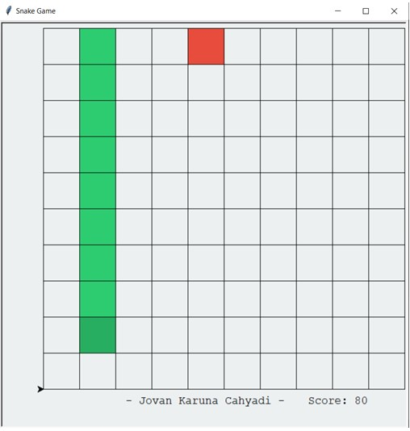

# Snake Game Solver
Solving a snake game using Greedy algorithm with GUI to show the snake winning the game

 

### Prerequisite
1. python 3

### Compile and Running
Can run in both Windows and Linux
1. Open Command Prompt 
1. type `python snakesolver.py`
1. It will pop up a window of snake game and the snake will use the path from greedy to move until the game is finished

## Acknowledgement
This project is made to fulfill IF2211 Algorithm and Strategy assignment.
Created By : Jovan Karuna Cahyadi 
